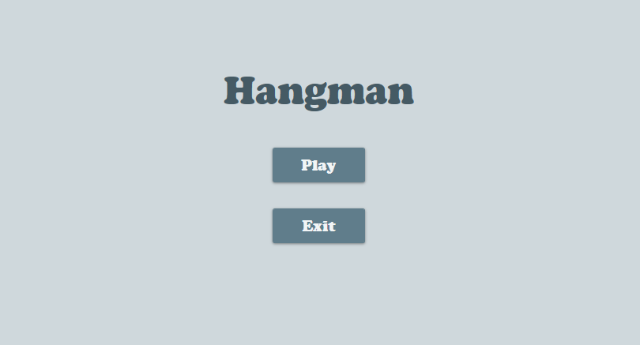
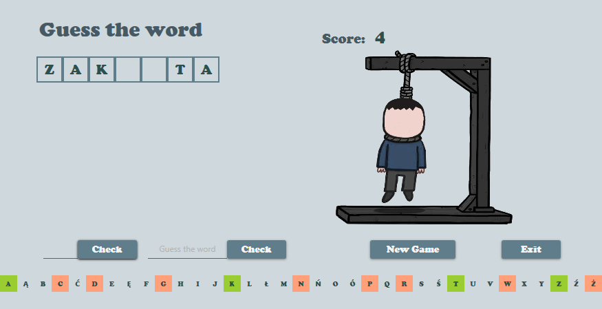

# Hangman
> Simple game in C #.

## Table of contents
* [General info](#general-info)
* [Screenshots](#screenshots)
* [Technologies](#technologies)
* [Setup](#setup)
* [Features](#features)
* [Status](#status)
* [Inspiration](#inspiration)
* [Contact](#contact)

## General info
The goal of the project is to implement a simple desktop application in C #, working in the user's graphical environment, using the WPF framework (UWP, fluent UI, ...). Hangman was part of a semester long project for our second year at the WSEI. We have chosen to develop this game because it appeared to us as a complete exercice in adequation to our level.

## Screenshots

## Technologies
* Json.Net - v1.0.18
* MaterialDesignColors - v1.2.2
* MaterialDesignThemes - v3.0.1
* MSTest.TestAdapter - v1.3.2
* MSTest.TestFramework - v1.3.2

## Setup
1.Download/clone _Mini-games_ repo.
2.Find folders: Installer -> Installer-SetupFiles.
3.Install game.
4.You can find a game folder in program files.

## Features
* Write documentation

## Status
Project is: _in progress_

## Inspiration

## Contact
Created by:
[@Snorakx](https://github.com/Snorakx) 
[@FiPiL99](https://github.com/FiPiL99) 
[@liwiakawa](https://github.com/liwiakawa) 
Feel free to contact us!
